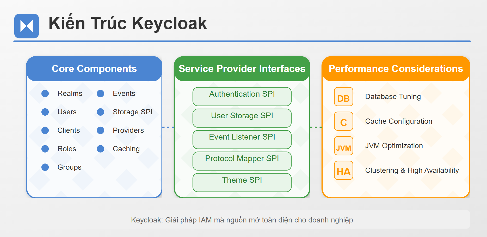

# Keycloak Architecture

<figure><figcaption><p>Keycloak Architecture</p></figcaption></figure>

### Core components: Realms, Users, Clients, Roles, Groups

Keycloak được xây dựng dựa trên một kiến trúc có khả năng mở rộng cao với các thành phần cốt lõi tạo nên sự linh hoạt và mạnh mẽ của nó. Hãy cùng tìm hiểu chi tiết về các thành phần này:

#### Realms

Realm là khái niệm cơ bản nhất trong Keycloak, đóng vai trò như một container cô lập cho tất cả các thành phần khác.

**Đặc điểm chính**:

* Mỗi realm hoạt động như một đơn vị quản lý danh tính riêng biệt
* Có cấu hình và chính sách bảo mật riêng
* Quản lý một tập hợp riêng các người dùng, clients, vai trò, nhóm
* Có thể cấu hình với nhiều nhà cung cấp danh tính khác nhau
* Sở hữu chứng chỉ và khóa mã hóa riêng

**Loại realms**:

1. **Master Realm**: Realm đầu tiên được tạo khi cài đặt Keycloak, dùng để quản trị và tạo các realm khác
2. **Custom Realms**: Các realm do quản trị viên tạo để phục vụ nhu cầu cụ thể

**Cấu trúc và cài đặt**:

* Mỗi realm có các cài đặt riêng về token, phiên làm việc, đăng ký người dùng
* Có thể cấu hình các trình xử lý sự kiện (event listeners)
* Hỗ trợ các giao thức xác thực khác nhau (OpenID Connect, SAML)
* Có thể thiết lập chính sách mật khẩu riêng

#### Users (Người dùng)

Users đại diện cho người dùng cuối sử dụng các ứng dụng được bảo vệ bởi Keycloak.

**Đặc điểm chính**:

* Được tạo trong phạm vi của một realm cụ thể
* Có thể được định nghĩa cục bộ trong Keycloak hoặc được nhập từ nguồn bên ngoài (LDAP, Active Directory)
* Có thể sở hữu thuộc tính tùy chỉnh
* Có thể tự đăng ký nếu được cấu hình

**Thuộc tính của người dùng**:

* Thông tin cơ bản: tên, email, username
* Thông tin xã hội: first name, last name, avatar
* Thuộc tính tùy chỉnh: có thể mở rộng để lưu trữ dữ liệu bổ sung
* Thông tin phiên: trạng thái đăng nhập, xác thực hai yếu tố

**Quản lý người dùng**:

* Tạo và xóa người dùng
* Cập nhật thuộc tính
* Đặt lại mật khẩu
* Quản lý phiên làm việc
* Xem lịch sử đăng nhập và sự kiện

#### Clients (Khách hàng)

Clients đại diện cho các ứng dụng hoặc dịch vụ có thể khởi tạo quá trình xác thực với Keycloak.

**Đặc điểm chính**:

* Thực thể yêu cầu xác thực người dùng
* Có thể là các ứng dụng web, di động, dịch vụ API, v.v.
* Có ID và (tùy chọn) bí mật riêng
* Có thể được cấu hình cho từng giao thức (OIDC, SAML)

**Loại clients**:

1. **Public Clients**: Không thể giữ bí mật an toàn (ứng dụng JavaScript, ứng dụng di động)
2. **Confidential Clients**: Có thể bảo vệ bí mật (ứng dụng server-side)
3. **Bearer-only Clients**: Chỉ chấp nhận bearer tokens, không khởi tạo đăng nhập

**Cấu hình client**:

* URLs chuyển hướng cho phép
* Loại luồng xác thực (flows) được phép
* Scope mặc định
* Cài đặt token (thời gian sống, cấu hình JWT)
* Mappers thuộc tính (ánh xạ thông tin người dùng vào tokens)

#### Roles (Vai trò)

Roles là cơ chế chính để phân quyền trong Keycloak, cho phép kiểm soát chi tiết quyền truy cập vào các tài nguyên.

**Đặc điểm chính**:

* Được cấp cho người dùng để xác định quyền của họ
* Được sử dụng để kiểm soát quyền truy cập vào các tính năng và tài nguyên
* Có thể được phân cấp và thừa kế

**Loại vai trò**:

1. **Realm Roles**: Vai trò toàn cầu trong realm, có thể cấp cho bất kỳ người dùng nào
2. **Client Roles**: Vai trò cụ thể cho một client, chỉ áp dụng cho client đó
3. **Composite Roles**: Vai trò tổng hợp bao gồm nhiều vai trò khác

**Thực hành tốt nhất**:

* Sử dụng client roles cho quyền cụ thể ứng dụng
* Sử dụng realm roles cho quyền chung giữa các ứng dụng
* Định nghĩa composite roles để đơn giản hóa quản lý
* Ánh xạ rõ ràng giữa vai trò và quyền trong ứng dụng

#### Groups (Nhóm)

Groups cung cấp cách quản lý tập hợp người dùng và gán vai trò hàng loạt.

**Đặc điểm chính**:

* Cho phép quản lý tập trung các người dùng liên quan
* Có thể có cấu trúc phân cấp (nhóm con)
* Thừa kế vai trò từ nhóm cha
* Có thể có thuộc tính nhóm được ánh xạ vào token

**Trường hợp sử dụng**:

* Phân loại người dùng theo bộ phận hoặc chức năng
* Gán vai trò cho nhiều người dùng cùng lúc
* Quản lý quyền theo cấu trúc tổ chức
* Tự động áp dụng cài đặt cho người dùng dựa trên thành viên nhóm

**So sánh với vai trò**:

* Roles tập trung vào quyền, Groups tập trung vào tổ chức người dùng
* Groups có thể chứa Roles nhưng không ngược lại
* Groups có thể chứa người dùng và các nhóm con
* Groups hữu ích cho việc quản lý hàng loạt và phân cấp

### Event systems và Storage SPI

Keycloak cung cấp hệ thống sự kiện mạnh mẽ và các Storage Service Provider Interfaces (SPIs) để mở rộng khả năng của nó.

#### Event System

Hệ thống sự kiện trong Keycloak theo dõi và ghi lại các hoạt động quan trọng, cho phép tích hợp với các hệ thống bên ngoài và kiểm toán.

**Loại sự kiện**:

1. **Admin Events**: Các hoạt động quản trị (tạo người dùng, cập nhật client, v.v.)
2. **Login Events**: Các hoạt động liên quan đến xác thực (đăng nhập, đăng xuất, làm mới token)

**Chức năng chính**:

* **Ghi nhật ký**: Ghi lại sự kiện vào cơ sở dữ liệu Keycloak
* **Lưu trữ**: Cấu hình thời gian lưu trữ sự kiện
* **Lọc**: Lọc các loại sự kiện được lưu
* **Listeners**: Triển khai các trình xử lý tùy chỉnh để phản ứng với sự kiện

**Tùy chỉnh Event Listeners**: Keycloak cho phép triển khai Event Listeners tùy chỉnh để xử lý các sự kiện theo cách riêng:

```java
public class CustomEventListener implements EventListenerProvider {
    @Override
    public void onEvent(Event event) {
        // Xử lý login event
    }

    @Override
    public void onEvent(AdminEvent event, boolean includeRepresentation) {
        // Xử lý admin event
    }

    @Override
    public void close() {
        // Dọn dẹp tài nguyên
    }
}
```

**Trường hợp sử dụng**:

* Tích hợp với hệ thống SIEM (Security Information and Event Management)
* Tạo báo cáo tùy chỉnh
* Kích hoạt quy trình tự động dựa trên sự kiện
* Cảnh báo về hoạt động đáng ngờ

#### Storage SPI

Keycloak cung cấp Service Provider Interfaces (SPIs) cho việc lưu trữ để cho phép tùy chỉnh cách lưu trữ và truy xuất dữ liệu.

**Các Provider lưu trữ chính**:

1. **UserProvider**: Quản lý người dùng và thông tin người dùng
2. **UserCredentialProvider**: Xử lý thông tin đăng nhập của người dùng
3. **RoleProvider**: Quản lý vai trò
4. **GroupProvider**: Quản lý nhóm
5. **ClientProvider**: Quản lý client

**Cài đặt lưu trữ mặc định**:

* JPA (Java Persistence API) qua Hibernate
* Hỗ trợ nhiều cơ sở dữ liệu: PostgreSQL, MySQL, Oracle, SQL Server, v.v.

**Tùy chỉnh lưu trữ**:

* Triển khai các provider tùy chỉnh
* Tích hợp với các nguồn danh tính bên ngoài (LDAP, Active Directory)
* Kết nối với cơ sở dữ liệu hiện có
* Tạo giải pháp lai sử dụng nhiều nguồn dữ liệu

**Ví dụ User Storage SPI**:

```java
public class CustomUserStorageProvider implements UserStorageProvider,
        UserLookupProvider,
        CredentialInputValidator {
    
    @Override
    public UserModel getUserByUsername(String username, RealmModel realm) {
        // Lấy người dùng từ hệ thống bên ngoài
    }
    
    @Override
    public boolean supportsCredentialType(String credentialType) {
        return PasswordCredentialModel.TYPE.equals(credentialType);
    }
    
    @Override
    public boolean isValid(RealmModel realm, UserModel user, CredentialInput input) {
        // Xác thực người dùng với hệ thống bên ngoài
    }
    
    // Các phương thức khác...
}
```

### Providers và Service Provider Interfaces (SPI)

Keycloak được xây dựng dựa trên kiến trúc modular với các SPI cho phép mở rộng và tùy chỉnh hầu hết các khía cạnh.

#### Tổng quan về SPI

Service Provider Interfaces (SPIs) là cơ chế chính để mở rộng chức năng của Keycloak.

**Nguyên tắc hoạt động**:

* Keycloak định nghĩa các interface chuẩn (SPIs)
* Các nhà phát triển triển khai các interface này (Providers)
* Keycloak tải và sử dụng các provider thông qua cơ chế phát hiện

**Ưu điểm của kiến trúc SPI**:

* Khả năng tùy chỉnh cao
* Dễ dàng thay thế chức năng mặc định
* Tích hợp với các hệ thống bên ngoài
* Bảo trì mã nguồn dễ dàng hơn

#### Các SPI quan trọng

Keycloak cung cấp nhiều SPI để tùy chỉnh hầu hết các khía cạnh của hệ thống:

1. **Authentication SPI**
   * Xác thực người dùng
   * Triển khai các phương thức xác thực tùy chỉnh
   * Tạo luồng xác thực mới
2. **Event Listener SPI**
   * Lắng nghe và xử lý các sự kiện xác thực và quản trị
   * Tích hợp với hệ thống bên ngoài
3. **User Storage SPI**
   * Kết nối với các kho lưu trữ người dùng bên ngoài
   * Đồng bộ hóa người dùng từ các nguồn bên ngoài
4. **Client Registration SPI**
   * Tùy chỉnh cách đăng ký và quản lý client
5. **Protocol Mapper SPI**
   * Điều chỉnh thông tin trong token
   * Ánh xạ thuộc tính người dùng vào token
6. **Policy SPI**
   * Thực thi các chính sách truy cập tùy chỉnh
   * Kiểm soát quyền truy cập chi tiết
7. **Theme SPI**
   * Tùy chỉnh giao diện người dùng
   * Tạo chủ đề mới cho các màn hình

#### Triển khai Provider

Để triển khai một provider trong Keycloak, cần thực hiện các bước sau:

1. **Triển khai Provider Interface**:

```java
public class CustomAuthenticator implements Authenticator {
    @Override
    public void authenticate(AuthenticationFlowContext context) {
        // Logic xác thực tùy chỉnh
    }
    
    @Override
    public void action(AuthenticationFlowContext context) {
        // Logic xử lý hành động
    }
    
    @Override
    public boolean requiresUser() {
        return false;
    }
    
    @Override
    public boolean configuredFor(KeycloakSession session, RealmModel realm, UserModel user) {
        return true;
    }
    
    @Override
    public void setRequiredActions(KeycloakSession session, RealmModel realm, UserModel user) {
        // Thiết lập các hành động bắt buộc
    }
    
    @Override
    public void close() {
        // Dọn dẹp tài nguyên
    }
}
```

2. **Triển khai Factory**:

```java
public class CustomAuthenticatorFactory implements AuthenticatorFactory {
    public static final String PROVIDER_ID = "custom-authenticator";
    
    @Override
    public String getDisplayType() {
        return "Custom Authenticator";
    }
    
    @Override
    public String getReferenceCategory() {
        return "custom";
    }
    
    @Override
    public boolean isConfigurable() {
        return true;
    }
    
    @Override
    public Authenticator create(KeycloakSession session) {
        return new CustomAuthenticator();
    }
    
    // Các phương thức khác...
}
```

3. **Đăng ký Provider**: Tạo file `META-INF/services/org.keycloak.authentication.AuthenticatorFactory` với nội dung:

```
com.example.CustomAuthenticatorFactory
```

4. **Đóng gói và triển khai**:

* Đóng gói thành JAR hoặc module
* Thêm vào thư mục providers của Keycloak hoặc triển khai như một module JBoss

#### Mô hình hoạt động của Provider

Keycloak sử dụng mô hình factory cho các provider của nó:

1. **Factory Pattern**:
   * Factory tạo ra các instance của provider
   * Factory cung cấp thông tin về provider (tên, mô tả, v.v.)
   * Factory quản lý vòng đời của provider
2. **Provider Registry**:
   * Keycloak duy trì registry của tất cả các provider đã đăng ký
   * Tìm provider phù hợp cho một yêu cầu cụ thể
   * Cung cấp cơ chế ưu tiên khi có nhiều provider
3. **KeycloakSession**:
   * Trung tâm cho việc truy cập các provider
   * Mỗi yêu cầu có session riêng
   * Cung cấp context và factory cho các provider

### Caching và performance considerations

Keycloak cung cấp nhiều cơ chế để tối ưu hóa hiệu suất và khả năng mở rộng.

#### Hệ thống Cache

Keycloak sử dụng bộ nhớ đệm (caching) để giảm thiểu truy cập cơ sở dữ liệu và cải thiện thời gian phản hồi.

**Các cấp độ cache**:

1. **Local Cache**: Bộ nhớ đệm trong một instance Keycloak
2. **Distributed Cache**: Bộ nhớ đệm được chia sẻ giữa các instance Keycloak

**Các loại cache**:

1. **Realm Cache**: Lưu trữ cấu hình realm
2. **User Cache**: Lưu trữ thông tin người dùng
3. **Keys Cache**: Lưu trữ khóa mã hóa và giải mã
4. **Authentication Session Cache**: Lưu trữ phiên xác thực đang diễn ra

**Công nghệ cache**:

* Infinispan (mặc định)
* Có thể cấu hình cho các kịch bản khác nhau:
  * Standalone với local cache
  * Clustered với distributed cache

**Cấu hình Cache**:

```xml
<subsystem xmlns="urn:jboss:domain:infinispan:9.0">
    <cache-container name="keycloak">
        <local-cache name="realms">
            <object-memory size="10000"/>
        </local-cache>
        <local-cache name="users">
            <object-memory size="10000"/>
        </local-cache>
        <!-- Các cache khác -->
    </cache-container>
</subsystem>
```

#### Cân nhắc hiệu suất

Khi triển khai Keycloak trong môi trường production, có nhiều khía cạnh cần được xem xét để đảm bảo hiệu suất tối ưu:

**1. Database Tuning**

* **Connection Pooling**: Cấu hình pool kết nối cơ sở dữ liệu phù hợp
* **Indexing**: Đảm bảo các chỉ mục phù hợp trên các bảng
* **Query Optimization**: Tối ưu hóa truy vấn cho các hoạt động thường xuyên
* **Database Choice**: Chọn cơ sở dữ liệu phù hợp với quy mô triển khai

**2. JVM Tuning**

* **Heap Size**: Cấu hình kích thước heap phù hợp với tải
* **Garbage Collection**: Tối ưu hóa cấu hình GC
* **JVM Options**: Điều chỉnh các tùy chọn JVM cho hiệu suất tốt nhất

Ví dụ JVM settings:

```
JAVA_OPTS="-Xms1024m -Xmx2048m -XX:MetaspaceSize=96M -XX:MaxMetaspaceSize=256m"
```

**3. Cache Tuning**

* **Cache Size**: Cấu hình kích thước cache phù hợp với bộ nhớ có sẵn
* **Eviction Policy**: Thiết lập chính sách hết hạn phù hợp
* **Distributed Cache**: Cấu hình cho môi trường cụm

**4. Network Optimization**

* **HTTP/2**: Bật HTTP/2 để cải thiện hiệu suất kết nối
* **Compression**: Bật nén gzip/deflate
* **Connection Timeouts**: Cấu hình timeout phù hợp

**5. Clustering và High Availability**

* **Load Balancing**: Cân bằng tải giữa các node
* **Session Affinity**: Cấu hình phiên sticky khi cần thiết
* **Failover**: Cấu hình chuyển đổi dự phòng

**Cấu hình clustered mode**:

```xml
<subsystem xmlns="urn:jboss:domain:infinispan:9.0">
    <cache-container name="keycloak" module="org.keycloak.keycloak-model-infinispan" statistics-enabled="true">
        <transport lock-timeout="60000"/>
        <distributed-cache name="sessions" owners="2"/>
        <distributed-cache name="authenticationSessions" owners="2"/>
        <distributed-cache name="offlineSessions" owners="2"/>
        <!-- Các cache khác -->
    </cache-container>
</subsystem>
```

**6. Lưu ý Hiệu suất Bổ sung**

* **Token Lifespan**: Cân nhắc thời gian sống của token (quá ngắn gây ra nhiều yêu cầu làm mới)
* **Event Storage**: Giới hạn lưu trữ sự kiện trong môi trường sản xuất
* **User Session Count**: Giám sát và giới hạn số lượng phiên đồng thời
* **Database Connections**: Cấu hình số lượng kết nối cơ sở dữ liệu phù hợp

**7. Monitoring và Profiling**

* **JMX Monitoring**: Bật giám sát JMX
* **Metrics Subsystem**: Sử dụng subsystem metrics của Keycloak
* **Prometheus Integration**: Kết hợp với Prometheus và Grafana
* **Logging Levels**: Điều chỉnh mức độ ghi log phù hợp

Ví dụ cấu hình metrics:

```xml
<subsystem xmlns="urn:wildfly:metrics:1.0" security-enabled="false" exposed-subsystems="*" prefix="${wildfly.metrics.prefix:wildfly}"/>
```

***

Kiến trúc Keycloak được thiết kế để linh hoạt và có thể mở rộng, cho phép tùy chỉnh gần như mọi khía cạnh của hệ thống. Hiểu rõ các thành phần cốt lõi và cách chúng tương tác với nhau là nền tảng để triển khai và quản lý Keycloak hiệu quả. Sử dụng các SPI, lưu trữ tùy chỉnh, và cấu hình cache phù hợp sẽ giúp xây dựng giải pháp IAM đáp ứng các yêu cầu cụ thể của tổ chức.
